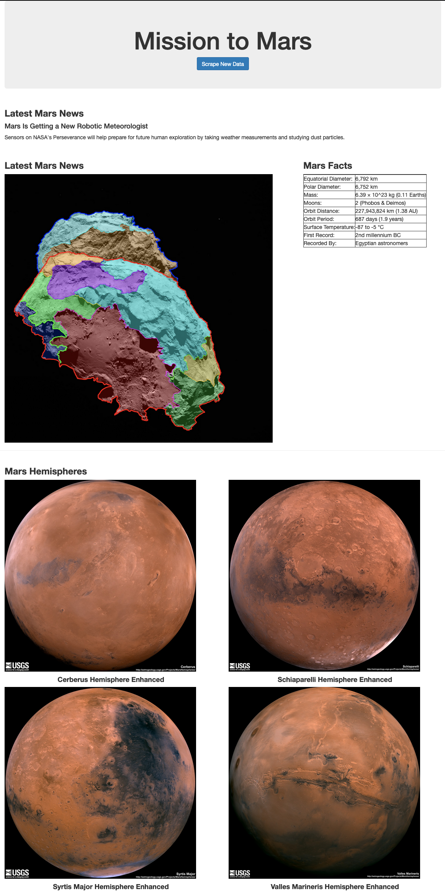

# Web Scraping Flask App
### Repository Table of Contents:
* Template Folder Holds the HTML file.
* Images Folder Holds the Screen shot image that is displayed at the bottom of the README File.
* mission_to_mars.py: this is where I wrote code to perform my original scrapes.
* mars_scrape.py: this is where I refactored the code from mission_to_mars.py and put all of those scrapes into one function so it could be imported by the app.py file to perform the scrapes.
* app.py: this is the Flask PyMongo code.

In this project, I created a flask app that scrapes several websites that are loaded with data about Mars.

1. First I scraped the [NASA Mars News Site](https://mars.nasa.gov/news/) and collected the latest News Title and Paragraph Text. I then assigned the text to variables that so I could reference it later. I used the following tools to accomplish this...
    * Selenium in conjunction with the FireFox webdriver to call and navigate the page.
    * BeautifulSoup to parse the page and extract the data.
    * Basic Python to define variable for later use.

2. Next, I visited the url for JPL Featured Space Image [here](https://www.jpl.nasa.gov/spaceimages/?search=&category=Mars). For this I used 
    * Selenium in conjunction with the FireFox webdriver to call and navigate the page.
    * Beautiful Soup to parse the page and extract the data.
    * Basic Python to define variable for later use.

3. Then, I visited the Mars Facts webpage [here](https://space-facts.com/mars/). Once there, I  used Pandas to scrape the table containing facts about the planet including Diameter, Mass, etc and converted it to an HTML String. I used the following tools...
    * Requests to access the website.
    * BeautigulSoup to scrape the website.
    * Pandas to convert the table to an html string.

4. Finally, I visited the USGS Astrogeology site [here](https://astrogeology.usgs.gov/search/results?q=hemisphere+enhanced&k1=target&v1=Mars) to obtain high resolution images for each of Mar's hemispheres. For this I used the following...
   * Selenium in conjunction with the FireFox webdriver to call and navigate the page.
   * Python in conjunction with sellenium to navigate the page and click the appropriate links.
   * I also used python to convert the data so I could call upon it later.

   ## Mongo DB and Flask App

   ### After I scraped the data, I refactored my code so that I could run it all as one function. Actually, I needed to create 2 functions.
   1. def configure_firefox_driver(): This allowed me to use the FireFox webdriver to access and navigate all of the necessary pages.
   2. def scrape(driver): This function consisted of the refactored scraping code that I scrape the websites in the flask app.
### After setting up the functions I created I created a Flask App that would call the two functions to perform the scrapes. My Flask App consisted of the following routes...
  * @app.route("/scrape"): This route performed the scrapes. After it scraped I had it store the data into a Mongo Data Base. I did this by using Flask PyMongo.
  * @app.route("/"): This route queried my Mongo database and passed the mars data into an HTML document. 
  * Finally, I created an index.html that would display the mars data. To do this, I needed to use Jinja to accept the rendered data from my flask @app.route("/") route.

###Below is a screenshot of my HTML Document:

